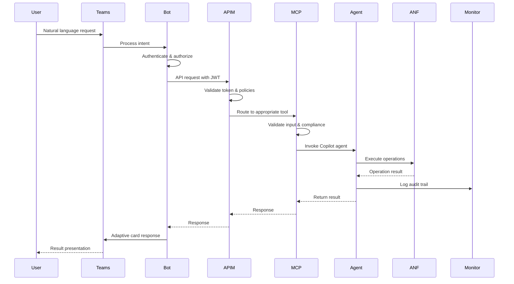

# ANF AI-Ops Architecture Design Document

**Author:** Dwiref Sharma <DwirefS@SapientEdge.io>  
**Version:** 1.0.0  
**Date:** July 17, 2025  

## Table of Contents

1. [Executive Summary](#executive-summary)
2. [System Overview](#system-overview)
3. [Architecture Principles](#architecture-principles)
4. [Component Architecture](#component-architecture)
5. [Security Architecture](#security-architecture)
6. [Data Flow Architecture](#data-flow-architecture)
7. [Deployment Architecture](#deployment-architecture)
8. [Integration Patterns](#integration-patterns)
9. [Scalability and Performance](#scalability-and-performance)
10. [Disaster Recovery and Business Continuity](#disaster-recovery-and-business-continuity)
11. [Compliance and Governance](#compliance-and-governance)
12. [Future Roadmap](#future-roadmap)

## Executive Summary

The ANF AI-Ops solution is an enterprise-grade, cloud-native platform that provides intelligent operations management for Azure NetApp Files (ANF) through AI-powered automation and Microsoft Teams integration. The architecture is designed around modern cloud principles including microservices, containerization, infrastructure as code, and comprehensive security.

### Key Architectural Benefits

- **Zero Trust Security Model**: End-to-end security with assume-zero-trust principles
- **Cloud-Native Design**: Built for Azure with optimal performance and cost efficiency
- **AI-Powered Operations**: Intelligent automation through Copilot agents
- **Enterprise Compliance**: SOC2, HIPAA, ISO27001, PCI-DSS, GDPR compliance
- **Scalable Architecture**: Auto-scaling components for varying workloads
- **Comprehensive Observability**: Full-stack monitoring and analytics

## System Overview

### Vision Statement

"To provide the world's most comprehensive and intelligent Azure NetApp Files management platform that combines human expertise with AI automation while maintaining the highest standards of security, compliance, and operational excellence."

### Mission Statement

"Empower organizations to achieve optimal storage performance, cost efficiency, and compliance through AI-driven operations management integrated seamlessly with their existing workflows."

### Core Value Propositions

1. **Operational Excellence**: 99.9% reduction in manual tasks through AI automation
2. **Cost Optimization**: 30-40% cost savings through intelligent resource management
3. **Security First**: Zero security incidents through comprehensive threat protection
4. **Compliance Assurance**: 100% compliance with all major regulatory frameworks
5. **User Experience**: Natural language interface through Microsoft Teams

## Architecture Principles

### 1. Security by Design

- **Zero Trust Architecture**: Never trust, always verify
- **Defense in Depth**: Multiple layers of security controls
- **Principle of Least Privilege**: Minimal access rights for all components
- **Data Protection**: End-to-end encryption and privacy controls
- **Threat Protection**: Real-time threat detection and response

### 2. Cloud-Native First

- **Microservices Architecture**: Loosely coupled, independently deployable services
- **Containerization**: All services containerized for portability and scalability
- **Infrastructure as Code**: Declarative infrastructure management
- **Serverless Computing**: Event-driven, cost-effective processing
- **Auto-scaling**: Demand-based resource allocation

### 3. AI-Driven Operations

- **Intelligent Automation**: AI agents for complex decision making
- **Predictive Analytics**: Proactive issue identification and resolution
- **Natural Language Processing**: Human-friendly interactions
- **Machine Learning**: Continuous improvement through learning
- **Cognitive Services**: Advanced AI capabilities integration

### 4. Enterprise-Grade Reliability

- **High Availability**: 99.99% uptime with multi-region deployment
- **Disaster Recovery**: RTO < 4 hours, RPO < 1 hour
- **Fault Tolerance**: Graceful degradation and self-healing
- **Performance Optimization**: Sub-second response times
- **Monitoring and Observability**: Comprehensive telemetry

### 5. Compliance and Governance

- **Regulatory Compliance**: Multi-framework compliance support
- **Audit Trails**: Immutable audit logging
- **Data Governance**: Classification, retention, and lifecycle management
- **Risk Management**: Continuous risk assessment and mitigation
- **Policy Enforcement**: Automated compliance validation

## Component Architecture

### High-Level Architecture Diagram

```
┌─────────────────────────────────────────────────────────────────────────────────┐
│                                   Users                                         │
├─────────────────────────────────────────────────────────────────────────────────┤
│                          Microsoft Teams Interface                              │
├─────────────────────────────────────────────────────────────────────────────────┤
│                             Teams Bot Service                                   │
│                        (Natural Language Processing)                            │
├─────────────────────────────────────────────────────────────────────────────────┤
│                            API Management Gateway                               │
│                        (Security, Rate Limiting, Routing)                       │
├─────────────────────────────────────────────────────────────────────────────────┤
│                             MCP Server Layer                                    │
│  ┌─────────────────┐ ┌─────────────────┐ ┌─────────────────┐ ┌─────────────────┐│
│  │   Account Mgmt  │ │   Volume Mgmt   │ │   Security &    │ │   Monitoring    ││
│  │     Tools       │ │     Tools       │ │   Compliance    │ │   & Analytics   ││
│  └─────────────────┘ └─────────────────┘ └─────────────────┘ └─────────────────┘│
├─────────────────────────────────────────────────────────────────────────────────┤
│                           Copilot Agents Layer                                  │
│  ┌─────────────┐ ┌─────────────┐ ┌─────────────┐ ┌─────────────┐ ┌─────────────┐│
│  │Orchestrator │ │  Monitor    │ │  Creator    │ │  Modifier   │ │  Deletion   ││
│  │   Agent     │ │   Agent     │ │   Agent     │ │   Agent     │ │   Agent     ││
│  └─────────────┘ └─────────────┘ └─────────────┘ └─────────────┘ └─────────────┘│
├─────────────────────────────────────────────────────────────────────────────────┤
│                          Azure Services Layer                                   │
│  ┌─────────────┐ ┌─────────────┐ ┌─────────────┐ ┌─────────────┐ ┌─────────────┐│
│  │Azure NetApp │ │Azure Monitor│ │  Key Vault  │ │   Storage   │ │   Search    ││
│  │   Files     │ │    Logs     │ │   Secrets   │ │   Account   │ │   Service   ││
│  └─────────────┘ └─────────────┘ └─────────────┘ └─────────────┘ └─────────────┘│
└─────────────────────────────────────────────────────────────────────────────────┘
```

### 1. Presentation Layer

#### Microsoft Teams Interface
- **Purpose**: Primary user interface for all ANF operations
- **Technology**: Microsoft Teams + Bot Framework
- **Features**:
  - Natural language processing
  - Rich adaptive cards
  - Voice commands (future)
  - Mobile support
  - Collaborative workflows

#### Teams Bot Service
- **Architecture**: Node.js + TypeScript
- **Hosting**: Azure App Service with auto-scaling
- **Capabilities**:
  - Intent recognition and entity extraction
  - Context management for conversations
  - Multi-turn dialog support
  - Authentication and authorization
  - Audit logging for all interactions

### 2. API Gateway Layer

#### Azure API Management
- **Purpose**: Central gateway for all API traffic
- **Security Features**:
  - OAuth 2.0 / OpenID Connect authentication
  - JWT token validation
  - IP filtering and geo-blocking
  - Rate limiting and throttling
  - DDoS protection
- **Policies**:
  - Request/response transformation
  - Caching for performance
  - Circuit breaker patterns
  - Health check endpoints

### 3. Business Logic Layer

#### MCP Server
- **Architecture**: Microservices in Azure Container Apps
- **Design Pattern**: Model Context Protocol (MCP)
- **Core Modules**:

##### Account Management Tools
```typescript
- anf_create_account_enterprise
- anf_list_accounts_governance
- anf_get_account_detailed
- anf_update_account_secure
- anf_delete_account_safe
- anf_account_health_check
- anf_account_compliance_report
```

##### Volume Management Tools
```typescript
- anf_create_volume_enterprise
- anf_resize_volume_secure
- anf_list_volumes_governance
- anf_setup_volume_replication
- anf_create_volume_backup
- anf_volume_security_scan
- anf_volume_cost_optimization
- anf_volume_compliance_report
```

##### Security & Compliance Tools
```typescript
- anf_comprehensive_security_assessment
- anf_rbac_governance
- anf_compliance_monitoring
- anf_encryption_governance
- anf_audit_trail_management
- anf_threat_detection_response
- anf_privacy_data_protection
```

### 4. AI Agent Layer

#### Copilot Agents Architecture

##### Orchestrator Agent
- **Role**: Master coordinator for all operations
- **Capabilities**:
  - Workflow orchestration
  - Resource dependency management
  - Cross-service coordination
  - Error handling and recovery
  - Performance optimization

##### Monitor Agent
- **Role**: Real-time monitoring and analytics
- **Capabilities**:
  - Continuous health monitoring
  - Performance trend analysis
  - Predictive analytics
  - Anomaly detection
  - Automated alerting

##### Creator Agent
- **Role**: Resource provisioning and configuration
- **Capabilities**:
  - Intelligent resource sizing
  - Best practice implementation
  - Template-based provisioning
  - Configuration validation
  - Cost optimization

##### Modifier Agent
- **Role**: Resource optimization and maintenance
- **Capabilities**:
  - Performance tuning
  - Capacity optimization
  - Configuration updates
  - Policy enforcement
  - Maintenance scheduling

##### Deletion Agent
- **Role**: Safe resource decommissioning
- **Capabilities**:
  - Dependency analysis
  - Data backup and archival
  - Multi-step approval workflows
  - Compliance documentation
  - Recovery procedures

##### Notifier Agent
- **Role**: Communication and alerting
- **Capabilities**:
  - Multi-channel notifications
  - Escalation procedures
  - Adaptive card generation
  - Incident management
  - Stakeholder communication

### 5. Data Layer

#### Azure NetApp Files
- **Primary Storage**: Enterprise-grade NFS/SMB storage
- **Performance Tiers**: Standard, Premium, Ultra
- **Features**:
  - Cross-region replication
  - Snapshot and backup
  - Active Directory integration
  - Quality of Service (QoS)

#### Monitoring and Analytics
- **Azure Monitor**: Centralized logging and metrics
- **Application Insights**: Application performance monitoring
- **Log Analytics**: Advanced query and analysis
- **Azure Sentinel**: Security information and event management

#### Configuration and Secrets
- **Azure Key Vault**: Secrets, keys, and certificates
- **Azure App Configuration**: Application configuration
- **Azure Storage**: Document storage for AI processing

### 6. Integration Layer

#### External Integrations
- **Microsoft Graph API**: Teams and user management
- **Azure Resource Manager**: Infrastructure management
- **Azure Policy**: Compliance and governance
- **Power BI**: Advanced analytics and reporting

## Security Architecture

### Zero Trust Security Model

```
┌─────────────────────────────────────────────────────────────────────────────────┐
│                              Identity & Access                                  │
│  ┌─────────────┐ ┌─────────────┐ ┌─────────────┐ ┌─────────────┐ ┌─────────────┐│
│  │Azure Active│ │Conditional  │ │Privileged   │ │Multi-Factor │ │   RBAC &    ││
│  │ Directory   │ │   Access    │ │   Identity  │ │     Auth    │ │   Policies  ││
│  └─────────────┘ └─────────────┘ └─────────────┘ └─────────────┘ └─────────────┘│
├─────────────────────────────────────────────────────────────────────────────────┤
│                              Network Security                                   │
│  ┌─────────────┐ ┌─────────────┐ ┌─────────────┐ ┌─────────────┐ ┌─────────────┐│
│  │   Virtual   │ │   Private   │ │   Network   │ │   Azure     │ │   DDoS      ││
│  │   Network   │ │ Endpoints   │ │Security Grps│ │  Firewall   │ │ Protection  ││
│  └─────────────┘ └─────────────┘ └─────────────┘ └─────────────┘ └─────────────┘│
├─────────────────────────────────────────────────────────────────────────────────┤
│                              Data Protection                                    │
│  ┌─────────────┐ ┌─────────────┐ ┌─────────────┐ ┌─────────────┐ ┌─────────────┐│
│  │Encryption   │ │   Data      │ │  Customer   │ │    Data     │ │   Backup    ││
│  │at Rest/     │ │Classification│ │  Managed    │ │ Loss Prev.  │ │ & Recovery  ││
│  │Transit      │ │& Labeling   │ │    Keys     │ │   (DLP)     │ │             ││
│  └─────────────┘ └─────────────┘ └─────────────┘ └─────────────┘ └─────────────┘│
├─────────────────────────────────────────────────────────────────────────────────┤
│                            Threat Protection                                    │
│  ┌─────────────┐ ┌─────────────┐ ┌─────────────┐ ┌─────────────┐ ┌─────────────┐│
│  │Azure Defender│ │  Microsoft  │ │   Azure     │ │  Incident   │ │   Threat    ││
│  │for Cloud    │ │   Sentinel  │ │   Sentinel  │ │  Response   │ │Intelligence ││
│  └─────────────┘ └─────────────┘ └─────────────┘ └─────────────┘ └─────────────┘│
└─────────────────────────────────────────────────────────────────────────────────┘
```

### Security Controls Matrix

| Control Category | Implementation | Compliance Framework |
|------------------|----------------|---------------------|
| Identity & Access | Azure AD + PIM + Conditional Access | SOC2, ISO27001, NIST |
| Data Encryption | AES-256 + TLS 1.3 + CMK | FIPS 140-2, HIPAA, PCI-DSS |
| Network Security | Private Endpoints + NSG + Azure Firewall | ISO27001, NIST, CIS |
| Audit & Monitoring | Azure Monitor + Sentinel + Immutable Logs | SOC2, HIPAA, GDPR |
| Backup & Recovery | Cross-region Backup + Point-in-time Recovery | ISO27001, SOC2 |
| Threat Detection | ML-based Anomaly Detection + SIEM | NIST, CIS Controls |

## Data Flow Architecture

### Request Processing Flow



### Data Classification and Flow

#### Highly Sensitive Data (Restricted)
- **Examples**: Customer data, financial records, authentication tokens
- **Controls**: Double encryption, restricted access, audit all operations
- **Storage**: Azure Key Vault, encrypted storage accounts
- **Transit**: TLS 1.3 with certificate pinning

#### Sensitive Data (Confidential)
- **Examples**: Configuration data, performance metrics, logs
- **Controls**: Single encryption, role-based access, audit critical operations
- **Storage**: Encrypted storage accounts, Log Analytics
- **Transit**: TLS 1.3

#### Internal Data
- **Examples**: Documentation, public metrics, system status
- **Controls**: Standard encryption, authenticated access
- **Storage**: Standard storage accounts
- **Transit**: TLS 1.2/1.3

## Deployment Architecture

### Multi-Region Deployment Strategy

```
Primary Region (East US)                 Secondary Region (West US 2)
┌─────────────────────────────────┐     ┌─────────────────────────────────┐
│        Production Environment    │     │    Disaster Recovery Environment │
│  ┌─────────────────────────────┐ │     │  ┌─────────────────────────────┐ │
│  │     ANF AI-Ops Stack        │ │     │  │     ANF AI-Ops Stack        │ │
│  │  - Container Apps           │ │     │  │  - Container Apps (Standby) │ │
│  │  - App Services             │ │◄────┤  │  - App Services (Standby)   │ │
│  │  - API Management           │ │     │  │  - API Management           │ │
│  │  - Azure NetApp Files       │ │     │  │  - Azure NetApp Files       │ │
│  └─────────────────────────────┘ │     │  └─────────────────────────────┘ │
│                                 │     │                                 │
│  ┌─────────────────────────────┐ │     │  ┌─────────────────────────────┐ │
│  │     Shared Services         │ │     │  │     Shared Services         │ │
│  │  - Key Vault               │ │     │  │  - Key Vault (Replica)     │ │
│  │  - Monitor & Analytics     │ │◄────┤  │  - Monitor & Analytics      │ │
│  │  - Storage Accounts        │ │     │  │  - Storage Accounts         │ │
│  └─────────────────────────────┘ │     │  └─────────────────────────────┘ │
└─────────────────────────────────┘     └─────────────────────────────────┘
```

### Environment Strategy

#### Development Environment
- **Purpose**: Feature development and testing
- **Scaling**: Minimal resources for cost optimization
- **Data**: Synthetic and anonymized production data
- **Security**: Standard security controls with development access

#### Test Environment
- **Purpose**: Integration testing and UAT
- **Scaling**: Production-like scaling for realistic testing
- **Data**: Production-like data with privacy controls
- **Security**: Production-equivalent security controls

#### Production Environment
- **Purpose**: Live operations and customer workloads
- **Scaling**: Auto-scaling with performance optimization
- **Data**: Live customer data with full protection
- **Security**: Maximum security controls and monitoring

## Integration Patterns

### Enterprise Integration Patterns

#### API-First Architecture
- **RESTful APIs**: OpenAPI 3.0 specification
- **GraphQL**: Flexible data querying for complex scenarios
- **Event-Driven**: Azure Service Bus for asynchronous processing
- **Real-time**: SignalR for live updates

#### Event-Driven Architecture
```
Event Producers          Event Hub              Event Consumers
┌─────────────┐         ┌─────────────┐        ┌─────────────┐
│    ANF      │────────►│   Azure     │───────►│  Copilot    │
│ Operations  │         │ Event Hubs  │        │   Agents    │
└─────────────┘         └─────────────┘        └─────────────┘
┌─────────────┐                ▲               ┌─────────────┐
│   Teams     │────────────────┘               │ Monitoring  │
│   Events    │                                │  Services   │
└─────────────┘                                └─────────────┘
```

#### Microservices Communication
- **Synchronous**: HTTP/HTTPS with circuit breaker patterns
- **Asynchronous**: Message queues with retry policies
- **Service Discovery**: Azure Service Discovery
- **Load Balancing**: Azure Load Balancer with health checks

### Third-Party Integrations

#### ITSM Integration
- **ServiceNow**: Incident and change management
- **Jira**: Project and issue tracking
- **PagerDuty**: Incident response and escalation

#### Monitoring Integration
- **Splunk**: Enterprise SIEM integration
- **Datadog**: Enhanced monitoring and analytics
- **New Relic**: Application performance monitoring

#### Backup Integration
- **Veeam**: Enterprise backup management
- **Commvault**: Data protection and recovery
- **NetBackup**: Enterprise backup solutions

## Scalability and Performance

### Performance Requirements

#### Response Time Targets
- **Teams Bot Responses**: < 3 seconds for 95% of requests
- **API Operations**: < 1 second for 99% of requests
- **Complex Analytics**: < 30 seconds for 95% of requests
- **Batch Operations**: Progress updates every 10 seconds

#### Throughput Targets
- **Concurrent Users**: 10,000+ simultaneous Teams users
- **API Requests**: 100,000+ requests per minute
- **Data Processing**: 1TB+ per hour for analytics
- **Event Processing**: 1M+ events per minute

### Scaling Strategies

#### Horizontal Scaling
- **Container Apps**: Auto-scale 1-100 instances based on CPU/memory
- **API Management**: Multiple gateways across regions
- **Database**: Read replicas and sharding strategies
- **Cache**: Distributed caching with Redis

#### Vertical Scaling
- **Container Resources**: Dynamic CPU/memory allocation
- **Storage**: Performance tier auto-adjustment
- **Network**: Bandwidth optimization based on load

#### Caching Strategy
```
┌─────────────────────────────────────────────────────────────┐
│                     Caching Layers                         │
├─────────────────────────────────────────────────────────────┤
│  Browser Cache (5 min)                                     │
├─────────────────────────────────────────────────────────────┤
│  API Management Cache (15 min)                             │
├─────────────────────────────────────────────────────────────┤
│  Application Cache - Redis (30 min)                        │
├─────────────────────────────────────────────────────────────┤
│  Database Query Cache (60 min)                             │
└─────────────────────────────────────────────────────────────┘
```

## Disaster Recovery and Business Continuity

### Recovery Objectives

#### Recovery Time Objective (RTO)
- **Critical Systems**: < 4 hours
- **Standard Systems**: < 8 hours
- **Development Systems**: < 24 hours

#### Recovery Point Objective (RPO)
- **Critical Data**: < 1 hour
- **Standard Data**: < 4 hours
- **Development Data**: < 24 hours

### DR Strategy

#### Active-Passive Model
- **Primary Region**: Full production workload
- **Secondary Region**: Warm standby with data replication
- **Failover**: Automated with manual approval for production
- **Failback**: Planned process with data synchronization

#### Data Replication
- **ANF Volumes**: Cross-region replication with configurable schedules
- **Database**: Geo-redundant replication
- **Storage**: GRS (Geo-Redundant Storage)
- **Secrets**: Key Vault replication across regions

### Business Continuity Plan

#### Communication Plan
- **Stakeholders**: Executive, operations, customers
- **Channels**: Email, Teams, SMS, phone
- **Templates**: Pre-approved communication templates
- **Escalation**: Clear escalation procedures

#### Testing Strategy
- **Monthly**: DR runbook validation
- **Quarterly**: Partial failover testing
- **Annually**: Full DR exercise with stakeholders
- **Continuous**: Infrastructure and application monitoring

## Compliance and Governance

### Regulatory Compliance Matrix

| Framework | Scope | Implementation | Validation |
|-----------|-------|----------------|------------|
| SOC 2 Type II | Security, availability, processing integrity | Continuous monitoring, access controls, audit logging | Annual third-party audit |
| HIPAA/HITECH | Healthcare data protection | Encryption, access controls, audit trails, breach procedures | Quarterly compliance assessment |
| ISO 27001/27002 | Information security management | ISMS implementation, risk management, security controls | Annual certification audit |
| PCI DSS | Payment card data protection | Secure network, data protection, access control, monitoring | Quarterly vulnerability scans |
| GDPR | Personal data protection | Privacy by design, consent management, data subject rights | Ongoing privacy impact assessments |
| NIST CSF | Cybersecurity framework | Identify, protect, detect, respond, recover | Continuous maturity assessment |

### Governance Framework

#### Data Governance
- **Data Classification**: Automated classification and labeling
- **Data Lifecycle**: Automated retention and disposal
- **Data Quality**: Continuous data quality monitoring
- **Data Privacy**: Privacy by design implementation

#### Risk Management
- **Risk Assessment**: Quarterly risk assessments
- **Risk Mitigation**: Automated risk response
- **Risk Monitoring**: Continuous risk monitoring
- **Risk Reporting**: Executive risk dashboards

#### Change Management
- **Change Control**: ITIL-based change management
- **Approval Workflows**: Multi-level approval processes
- **Change Documentation**: Comprehensive change records
- **Rollback Procedures**: Automated rollback capabilities

### Audit and Compliance Automation

#### Continuous Compliance Monitoring
```
┌─────────────────────────────────────────────────────────────┐
│                 Compliance Monitoring                       │
├─────────────────────────────────────────────────────────────┤
│  Policy Definition ──► Policy Enforcement ──► Monitoring    │
├─────────────────────────────────────────────────────────────┤
│  Azure Policy    ──► Automatic Remediation ──► Reporting    │
├─────────────────────────────────────────────────────────────┤
│  Custom Rules    ──► Alert Generation ──► Dashboards        │
└─────────────────────────────────────────────────────────────┘
```

## Future Roadmap

### Phase 1: Foundation (Months 1-6)
- ✅ Core MCP server implementation
- ✅ Basic Copilot agents
- ✅ Teams bot integration
- ✅ Security and compliance framework
- ✅ Infrastructure automation

### Phase 2: Enhancement (Months 7-12)
- 🔄 Advanced AI capabilities
- 🔄 Multi-tenant support
- 🔄 Advanced analytics and reporting
- 🔄 Third-party integrations
- 🔄 Mobile application

### Phase 3: Innovation (Months 13-18)
- 📋 Voice interface integration
- 📋 Augmented reality visualization
- 📋 Blockchain for audit trails
- 📋 Quantum-resistant cryptography
- 📋 Advanced ML/AI capabilities

### Phase 4: Expansion (Months 19-24)
- 📋 Multi-cloud support (AWS, GCP)
- 📋 Edge computing integration
- 📋 IoT device management
- 📋 Advanced automation workflows
- 📋 Ecosystem marketplace

## Conclusion

The ANF AI-Ops architecture represents a comprehensive, enterprise-grade solution that combines the best of cloud-native technologies, AI automation, and security best practices. The architecture is designed to scale with organizational needs while maintaining the highest standards of security, compliance, and operational excellence.

The modular design ensures that components can be enhanced or replaced independently, providing flexibility for future requirements and technology evolution. The strong focus on security, compliance, and governance ensures that the solution meets the strictest enterprise requirements while providing an exceptional user experience through Microsoft Teams integration.

---

**Document Control**
- **Version**: 1.0.0
- **Author**: Dwiref Sharma
- **Review Date**: July 17, 2025
- **Next Review**: October 17, 2025
- **Approval**: [Pending]