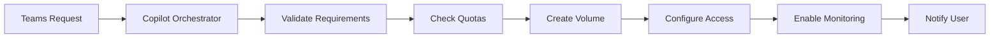
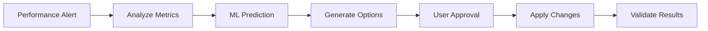

# Comprehensive Production-Grade Project Plan for Azure NetApp Files AI-Ops Solution

## Executive Introduction and Vision Statement

### Vision
Transform enterprise storage management through an intelligent, conversational AI-Ops platform that enables natural language interaction with Azure NetApp Files infrastructure. This solution empowers organizations to manage complex storage operations through simple conversations in Microsoft Teams, while implementing enterprise-grade security, compliance, and automated optimization capabilities.

### Strategic Objectives
- **Operational Excellence**: Reduce storage management overhead by 60-80% through intelligent automation
- **Cost Optimization**: Achieve 25-40% cost reduction through predictive analytics and automated rightsizing
- **Enhanced Reliability**: Deliver 99.99% uptime through self-healing capabilities and proactive issue prevention
- **Simplified Management**: Enable natural language storage management for all skill levels
- **Enterprise Security**: Implement Zero Trust architecture with comprehensive compliance coverage

## Core Architecture Design

### High-Level Architecture Overview

The Azure NetApp Files AI-Ops solution implements a microservices architecture with the following core components:

**MCP Server Layer**
- Model Context Protocol servers deployed on Azure Container Apps for scalability
- Native Azure service integration through managed identities
- Event-driven architecture using Azure Event Grid
- Multi-region deployment for high availability

**API Management Layer**
- Azure API Management as central gateway for all ANF APIs
- OAuth 2.0/OpenID Connect authentication
- Rate limiting and throttling policies
- API versioning and lifecycle management

**Copilot Agent Ecosystem**
- **Orchestrator Agent**: Coordinates complex multi-step operations
- **Monitoring Agent**: Real-time performance and health monitoring
- **Notification Agent**: Proactive alerts and status updates
- **Creator Agent**: Automated volume and pool provisioning
- **Modifier/Maintenance Agent**: Dynamic configuration updates
- **Deletion Agent**: Secure resource cleanup with validation

**Integration Layer**
- Microsoft Teams bot for natural language interface
- Azure Copilot Studio for agent development
- Power Automate for workflow automation
- GitOps integration for infrastructure as code

### Technical Architecture Components

```
User Interface Layer:
├── Microsoft Teams Bot
├── Adaptive Cards UI
└── Natural Language Processing

Copilot Layer:
├── Azure Copilot Studio
├── Orchestrator Agent
├── Specialized Agents (6 types)
└── Agent Communication Bus

API Gateway Layer:
├── Azure API Management
├── Authentication/Authorization
├── Rate Limiting/Throttling
└── API Version Management

MCP Server Layer:
├── Container Apps Deployment
├── MCP Protocol Implementation
├── Azure Service Integration
└── Event Processing

Storage Management Layer:
├── ANF REST APIs
├── PowerShell/CLI Integration
├── SDK Abstraction Layer
└── Error Handling/Retry Logic

Monitoring & Analytics Layer:
├── Azure Monitor/App Insights
├── Predictive Analytics (ML)
├── Cost Management
└── Performance Optimization

Security Layer:
├── Zero Trust Architecture
├── Private Endpoints
├── Azure AD/Entra ID
└── Encryption (TLS 1.3)
```

## Security Architecture (Multi-Layered)

### Network Security
- **Virtual Network Integration**: Dedicated VNets with subnet delegation for ANF
- **Network Security Groups**: Default-deny policies with granular allow rules
- **Private Endpoints**: All ANF communications through private endpoints
- **Azure Firewall Premium**: TLS inspection and threat intelligence
- **Application Gateway with WAF**: Protection against web-based attacks

### Identity and Access Management
- **Azure AD/Entra ID Integration**: Centralized identity management
- **Multi-Factor Authentication**: Enforced for all privileged operations
- **Privileged Identity Management (PIM)**: Just-in-time access with approval workflows
- **Service Principals**: Certificate-based authentication for automated processes
- **Conditional Access**: Risk-based access controls with device compliance

### Data Protection
- **Encryption at Rest**: AES-256 with customer-managed keys in Azure Key Vault
- **Encryption in Transit**: TLS 1.3 for all communications
- **Double Encryption Option**: Hardware-based encryption layer for sensitive data
- **HSM Integration**: FIPS 140-2 Level 3 compliance for key management

### Security Monitoring
- **Azure Sentinel**: AI-powered SIEM with custom detection rules
- **Microsoft Defender for Cloud**: Continuous security posture assessment
- **Fraud Detection**: ML-based anomaly detection for unauthorized activities
- **Comprehensive Logging**: All operations logged with tamper-proof audit trails

## Monitoring and Compliance Framework

### Comprehensive Monitoring Architecture
- **Application Insights**: Distributed tracing with correlation IDs
- **Custom Metrics**: ANF-specific KPIs (capacity, IOPS, latency, throughput)
- **Real-time Dashboards**: Azure Workbooks with 5-minute refresh intervals
- **Alert Framework**: Multi-dimensional alerts with escalation policies

### Compliance Coverage
- **SOC 2 Type II**: Continuous compliance with trust service criteria
- **ISO 27001/27002**: Information security management system implementation
- **GDPR**: Data privacy and protection measures
- **HIPAA**: Healthcare data protection (with BAA)
- **PCI-DSS**: Payment card data security

### Audit and Logging
- **Comprehensive Audit Trails**: All user-agent interactions logged
- **Log Retention**: 90 days hot, 2 years compliance, 7 years archive
- **Compliance Reporting**: Automated reports for auditors
- **Security Analytics**: Threat detection and investigation capabilities

## Detailed Use Cases for Enterprise Storage Management

### 1. Intelligent Capacity Management
**Natural Language Command**: "Show me all volumes approaching capacity limits in production"
- AI analyzes current capacity metrics across all volumes
- Predictive analytics forecast when limits will be reached
- Automated recommendations for capacity expansion
- One-click remediation through adaptive cards

### 2. Performance Optimization
**Natural Language Command**: "Optimize performance for my SAP HANA volumes"
- Automatic analysis of workload patterns
- Dynamic tier adjustment (Standard → Premium → Ultra)
- QoS policy optimization based on application requirements
- Cost-performance balance recommendations

### 3. Automated Disaster Recovery
**Natural Language Command**: "Set up disaster recovery for critical databases to West Europe"
- Automated cross-region replication configuration
- Intelligent snapshot scheduling based on RPO requirements
- Failover orchestration with health monitoring
- Regular DR testing automation

### 4. Cost Optimization
**Natural Language Command**: "Reduce my storage costs while maintaining SLAs"
- AI-driven cost analysis across all resources
- Automated rightsizing recommendations
- Cool tier migration for inactive data
- Reserved capacity purchase recommendations

### 5. Compliance Management
**Natural Language Command**: "Ensure all financial data meets SOC 2 requirements"
- Automated compliance scanning
- Policy enforcement through Azure Policy
- Audit report generation
- Remediation workflow triggers

## Cost Estimation Model

### Azure Resource Costs (Monthly Estimates)

**Compute Resources**
- Azure Container Apps (3 instances): $150-300
- Azure Functions (Premium plan): $200-400
- Application Gateway: $200-300

**Storage and Data**
- Azure NetApp Files (example 10TB): $2,000-4,000 (varies by tier)
- Log Analytics Workspace: $200-500
- Backup Storage: $100-300

**Security and Monitoring**
- Azure Sentinel: $300-1,000
- Microsoft Defender for Cloud: $15/server
- API Management (Developer): $50-200

**AI and Analytics**
- Azure Machine Learning: $100-500
- Copilot Studio: $200/month per agent
- Application Insights: $100-300

**Estimated Total Monthly Cost**: $3,500-7,500 (varies by scale)

### ROI Considerations
- **Labor Savings**: 60-80% reduction in storage management time
- **Incident Reduction**: 50% fewer storage-related incidents
- **Cost Optimization**: 25-40% reduction through intelligent management
- **Faster Provisioning**: 70% reduction in provisioning time

## Workflow Automation Architecture

### Core Workflows

**1. Volume Provisioning Workflow**


**2. Performance Optimization Workflow**


**3. Disaster Recovery Workflow**


## Technical Implementation Details

### MCP Server Implementation

**Container Apps Configuration**
```yaml
apiVersion: apps/v1
kind: Deployment
metadata:
  name: anf-mcp-server
spec:
  replicas: 3
  template:
    spec:
      containers:
      - name: mcp-server
        image: acr.azurecr.io/anf-mcp:latest
        env:
        - name: AZURE_CLIENT_ID
          valueFrom:
            secretKeyRef:
              name: azure-credentials
              key: client-id
        resources:
          requests:
            cpu: 500m
            memory: 1Gi
          limits:
            cpu: 1000m
            memory: 2Gi
```

**ANF API Abstraction Layer**
```python
class ANFOrchestrator:
    def __init__(self):
        self.anf_client = NetAppManagementClient(credential, subscription_id)
        self.monitor_client = MonitorManagementClient(credential, subscription_id)
        
    async def create_volume(self, request: VolumeRequest) -> VolumeResponse:
        # Validate request
        await self.validate_quota(request)
        
        # Create volume with retry logic
        volume = await self.anf_client.volumes.begin_create_or_update(
            resource_group_name=request.resource_group,
            account_name=request.account_name,
            pool_name=request.pool_name,
            volume_name=request.volume_name,
            body=request.to_volume_body()
        )
        
        # Enable monitoring
        await self.enable_monitoring(volume)
        
        return VolumeResponse(volume)
```

**Natural Language Processing**
```typescript
export class ANFNLPProcessor {
  async processCommand(command: string): Promise<Intent> {
    const intent = await this.recognizeIntent(command);
    const entities = await this.extractEntities(command);
    
    return {
      action: intent.topIntent,
      parameters: this.mapEntitiesToParameters(entities),
      confidence: intent.confidence
    };
  }
}
```

### Agent Orchestration Logic

**Multi-Agent Coordination**
```python
class AgentOrchestrator:
    def __init__(self):
        self.agents = {
            'monitor': MonitoringAgent(),
            'creator': CreatorAgent(),
            'modifier': ModifierAgent(),
            'notifier': NotificationAgent()
        }
    
    async def process_request(self, request):
        # Determine required agents
        required_agents = self.determine_agents(request)
        
        # Execute in parallel where possible
        tasks = []
        for agent_name in required_agents:
            tasks.append(self.agents[agent_name].process(request))
        
        results = await asyncio.gather(*tasks)
        return self.consolidate_results(results)
```

### Error Handling and Recovery

**Comprehensive Error Management**
```python
class ANFErrorHandler:
    @retry(
        stop=stop_after_attempt(3),
        wait=wait_exponential(multiplier=1, min=4, max=60),
        retry=retry_if_exception_type(RequestException)
    )
    async def execute_with_retry(self, operation):
        try:
            return await operation()
        except RateLimitException as e:
            await self.handle_rate_limit(e)
            raise
        except AuthenticationException as e:
            await self.refresh_credentials()
            raise
        except ANFServiceException as e:
            await self.log_and_alert(e)
            return self.graceful_degradation(e)
```

## Integration Architecture

### Azure Logic Apps Workflow
```json
{
  "definition": {
    "$schema": "https://schema.management.azure.com/providers/Microsoft.Logic/schemas/2016-06-01/workflowdefinition.json#",
    "triggers": {
      "ANF_Event": {
        "type": "EventGridTrigger",
        "inputs": {
          "events": ["Microsoft.NetApp.VolumeCreated"]
        }
      }
    },
    "actions": {
      "Process_Event": {
        "type": "Function",
        "inputs": {
          "function": {
            "id": "/subscriptions/.../functions/ProcessANFEvent"
          }
        }
      }
    }
  }
}
```

### Event-Driven Architecture
- Azure Event Grid for real-time event processing
- Service Bus for reliable message queuing
- Event Hubs for high-volume telemetry ingestion
- Functions for serverless event processing

## Production Deployment Instructions

### Infrastructure as Code

**Bicep Template Structure**
```
deployment/
├── main.bicep
├── modules/
│   ├── networking.bicep
│   ├── compute.bicep
│   ├── storage.bicep
│   ├── security.bicep
│   └── monitoring.bicep
├── parameters/
│   ├── dev.parameters.json
│   ├── staging.parameters.json
│   └── prod.parameters.json
└── scripts/
    ├── deploy.ps1
    └── validate.ps1
```

**Deployment Pipeline**
```yaml
trigger:
  branches:
    include:
    - main
    - release/*

stages:
- stage: Build
  jobs:
  - job: BuildAndTest
    steps:
    - task: Docker@2
      inputs:
        command: 'build'
        Dockerfile: '**/Dockerfile'
    - task: AzureCLI@2
      inputs:
        scriptType: 'bash'
        scriptLocation: 'inlineScript'
        inlineScript: |
          az bicep build --file deployment/main.bicep

- stage: DeployDev
  jobs:
  - deployment: DeployToDev
    environment: 'development'
    strategy:
      runOnce:
        deploy:
          steps:
          - task: AzureResourceManagerTemplateDeployment@3
```

### Testing and Validation Procedures

**Testing Framework**
1. **Unit Tests**: Component-level testing for all agents
2. **Integration Tests**: End-to-end workflow validation
3. **Load Tests**: Performance testing with Azure Load Testing
4. **Security Tests**: Penetration testing and vulnerability scanning
5. **Chaos Tests**: Resilience testing with Azure Chaos Studio

**Validation Checklist**
- [ ] All agents respond correctly to natural language commands
- [ ] Authentication and authorization work correctly
- [ ] Performance meets SLA requirements
- [ ] Security controls are properly implemented
- [ ] Monitoring and alerting function correctly
- [ ] Disaster recovery procedures work as expected

## Production-Ready Code Samples

### Teams Bot Implementation
```csharp
public class ANFBot : TeamsActivityHandler
{
    private readonly ILogger<ANFBot> _logger;
    private readonly IANFOrchestrator _orchestrator;
    
    protected override async Task OnMessageActivityAsync(
        ITurnContext<IMessageActivity> turnContext, 
        CancellationToken cancellationToken)
    {
        var userMessage = turnContext.Activity.Text;
        var intent = await _orchestrator.ProcessNaturalLanguageCommand(userMessage);
        
        var response = intent.Action switch
        {
            "CreateVolume" => await HandleCreateVolume(intent, cancellationToken),
            "MonitorPerformance" => await HandleMonitorPerformance(intent, cancellationToken),
            "OptimizeCosts" => await HandleOptimizeCosts(intent, cancellationToken),
            _ => "I didn't understand that command. Try 'help' for available options."
        };
        
        await turnContext.SendActivityAsync(
            MessageFactory.Attachment(CreateAdaptiveCard(response)), 
            cancellationToken);
    }
}
```

### Monitoring Implementation
```python
class ANFMonitor:
    def __init__(self):
        self.metrics_client = MetricsQueryClient(credential)
        self.logs_client = LogsQueryClient(credential)
        
    async def get_volume_metrics(self, volume_id: str) -> VolumeMetrics:
        query = f"""
        AzureMetrics
        | where ResourceId == '{volume_id}'
        | where MetricName in ('VolumeConsumedSize', 'ReadIops', 'WriteIops')
        | summarize avg(Average) by MetricName, bin(TimeGenerated, 5m)
        """
        
        response = await self.logs_client.query_workspace(
            workspace_id=self.workspace_id,
            query=query,
            timespan=timedelta(hours=1)
        )
        
        return self.parse_metrics(response)
```

## Innovative Features Implementation

### Predictive Analytics Engine
```python
class ANFPredictiveAnalytics:
    def __init__(self):
        self.ml_client = MLClient(credential, subscription_id, resource_group)
        
    async def predict_capacity(self, volume_id: str) -> CapacityPrediction:
        # Get historical data
        historical_data = await self.get_historical_metrics(volume_id)
        
        # Load trained model
        model = self.ml_client.models.get("anf-capacity-predictor", version="latest")
        
        # Prepare features
        features = self.prepare_features(historical_data)
        
        # Make prediction
        prediction = await model.predict(features)
        
        return CapacityPrediction(
            volume_id=volume_id,
            predicted_full_date=prediction.full_date,
            confidence=prediction.confidence,
            recommended_action=self.get_recommendation(prediction)
        )
```

### Self-Healing Implementation
```python
class ANFSelfHealing:
    async def auto_remediate(self, alert: Alert) -> RemediationResult:
        remediation_action = self.determine_remediation(alert)
        
        if remediation_action == "expand_capacity":
            return await self.expand_volume_capacity(alert.resource_id)
        elif remediation_action == "optimize_performance":
            return await self.optimize_performance_tier(alert.resource_id)
        elif remediation_action == "failover":
            return await self.initiate_failover(alert.resource_id)
        
        return RemediationResult(success=False, reason="No automated remediation available")
```

## Implementation Roadmap

### Phase 1: Foundation (Weeks 1-4)
- Deploy core infrastructure (VNet, Container Apps, APIM)
- Implement basic authentication and authorization
- Create monitoring agent with basic capabilities
- Deploy minimal Teams bot interface

### Phase 2: Core Functionality (Weeks 5-8)
- Implement all specialized agents
- Develop orchestration logic
- Create adaptive card templates
- Set up comprehensive monitoring

### Phase 3: Advanced Features (Weeks 9-12)
- Implement predictive analytics
- Add self-healing capabilities
- Integrate cost optimization
- Deploy advanced security features

### Phase 4: Production Readiness (Weeks 13-16)
- Complete security hardening
- Perform load testing
- Conduct security audits
- User acceptance testing
- Production deployment

## Success Metrics and KPIs

### Operational Metrics
- **Automation Rate**: >80% of routine tasks automated
- **Response Time**: <5 seconds for standard operations
- **Availability**: 99.99% uptime
- **MTTR**: <30 minutes for automated remediation

### Business Metrics
- **Cost Reduction**: 25-40% storage cost savings
- **Productivity**: 60-80% reduction in management time
- **User Satisfaction**: >90% satisfaction score
- **Incident Reduction**: 50% fewer storage incidents

### Technical Metrics
- **API Performance**: <100ms average latency
- **Prediction Accuracy**: >90% for capacity forecasting
- **Security Score**: >90% on Azure Security Center
- **Compliance Rate**: 100% audit compliance

## Conclusion

This comprehensive Azure NetApp Files AI-Ops solution represents a paradigm shift in enterprise storage management. By combining natural language processing, predictive analytics, intelligent automation, and enterprise-grade security, organizations can transform their storage operations from reactive management to proactive optimization.

The solution delivers immediate value through simplified management interfaces while providing long-term benefits through cost optimization, enhanced reliability, and operational excellence. With its microservices architecture, comprehensive security framework, and innovative AI-driven features, this platform positions organizations at the forefront of intelligent infrastructure management.